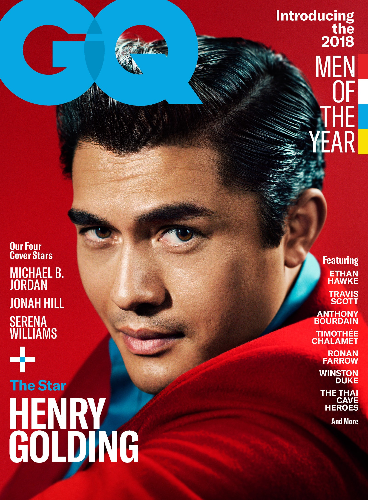
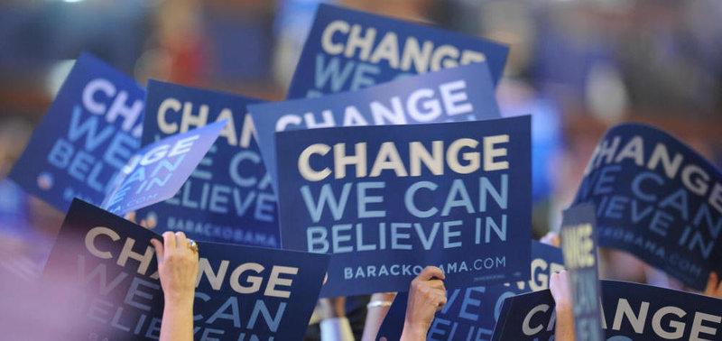
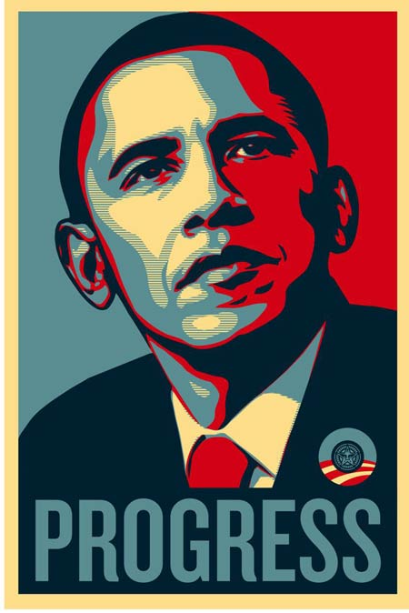

***IN*** 2000, Tobias Frere-Jones strolled through the cascading metropolis of New York City until he came across Manhattan's Port Authority Bus Terminal. This mundane bus station served as inspiration for the creation of a refreshing familiar, sans serif typeface featuring four widths and eight heights and exuded the bold and inviting essence of the American vernacular, namely Gotham. To be specific, Frere-jones was inspired by the charming sign of the Port Authority Bus Terminal and the characteristic letterings on buildings and shops around New York City. "I suppose there's a hidden personal agenda in the design," Frere-Jones said, "to preserve those old pieces of New York that could be wiped out before they're appreciated. Having grown up here, I was always fond of the 'old' New York and its lettering."

The Gotham typeface was originally commissioned by GQ magazine, whose editors wanted to rebrand the magazine with a "masculine, new and fresh" sans-serif with a "geometric structure." Johnathan Hoefler of Hoefler and Co and Frere-Jones' former business partner noted that GQ required something "that was going to be very fresh and very established to have a sort of credible voice to it.

The revitalized Gotham had much in common with Futura and other sans serifs from the Depression-era frequently used in North America and Europe, particularly Nazi Germany: 'Type, like architecture, like the organization of society itself, was to be reduced to its bare, efficient essentials, rid of undesirable, local or ethnic elements', or what the Nazi's liked to call, *Gleichschaltung* or "planification." Frere-Jones noted Gotham as "not the kind of letter a type designer would make. It's the kind of letter an engineer would make. It was born outside the type design in some other world and has a very distinct flavour from that."

> ### *"I suppose there's a hidden personal agenda in the design," Frere-Jones said, "to preserve those old pieces of New York that could be wiped out before they're appreciated. Having grown up here, I was always fond of the 'old' New York and its lettering."*

Since its inception, the minimalistic yet bold font came to be used widely and was praised for its "unspoken combination of contemporary sophistication for the nostalgia of America's past sense of duty." The font served as the typeface of the 2016 federal election campaign of the Australian Labor Party. Gotham was also used on the pillar of the One World Trade Center, a tower constructed on the grounds of the old New York World Trade Center. It serves as the current font for movie trailers in the US used for MPAA title cards. 

In addition to GQ, it was also used in Sports Illustrated Magazine and Coca Cola; numerous television shows including The Cohen Show, Saturday Night Live and The Tribeca Film Festival; Twitter, Netflix and is the official font of multiple institutions including Michigan State University, New York University, and the Singapore University of Technology and Design. However, what was arguably the defining moment that sealed Gotham brand as “uniquely American” was when it was used as the typography for Barack Obama’s 2008 presidential campaign.

## The Typeface of a Campaign

> ### *" Gotham is a sleek, purposefully not fancy, very straightforward, plainspoken font, but done with a great deal of elegance and taste–and drawn from very American sources."*

In 2008, Barack Obama became the 44th and first African American president of the United States. Some accredited the success of his candidacy to his meticulously designed campaign, while others attributed it to his ideas and propositions to improve the nation. Regardless, one cannot deny the monumental role that his impeccably designed and branded campaign played in his glorious victory. The design, led by the Chicago native political consultant, David Axelrod, rejected the conventional political design and redefined branding in elections.

The innovative use of colors, logos, symbols, campaign songs, and lettering reinforced Obama's "dynamic identity" and optimized his appeal during arguably one of the most volatile and evolutionary eras of the internet. "It really is a treat to see graphic design applied so well," said Jonathan Hoefler. "Visually, he is on message at every turn. I can't think of many corporations that use design so intelligently."

The lettering was perhaps one of the most memorable factors; the iconic blue, red, and white stenciled poster of Obama with "HOPE," "CHANGE," or "PROGRESS" in bold Gotham became one of the most widely recognized symbols of his candidacy. Initially, the campaign employed upper and lower case letters in the whimsical Gill Sans typeface, presumably to exude a friendly and welcoming aura to voters. However, as the campaign progressed, the designers adopted an all uppercase usage of Gotham to fortify a more authoritative and trustworthy image of Obama.

Gotham became the cornerstone of Obama's visual identity, and this happened not merely because the typeface was visually appealing but also because it suited the message of the brand. As opposed to Hillary's and McCain's use of traditional and perhaps hackneyed serif typefaces, the clean and modern sans-serif Gotham seemed better suited to represent the "dynamic, yet conscientious, American public servant." Graphic designer Michael Bierut, who later came to design the logo for Hillary Clinton's 2016 presidential campaign, commented, " Gotham is a sleek, purposefully not fancy, very straightforward, plainspoken font, but done with a great deal of elegance and taste–and drawn from very American sources."

Now to anyone who argues that font's aren't substantive, Obama is a testament to prove them otherwise.

### BIBLIOGRAPHY

* <https://medium.com/@brendansullydaniels/gotham-typeface-a-case-study-6f8414bd7589>
* [https://en.wikipedia.org/wiki/Gotham_(typeface)](https://en.wikipedia.org/wiki/Gotham_(typeface))
* <https://www.aiga.org/freedom-tower-type>
* <https://web.archive.org/web/20061127040331/http://www.typography.com/catalog/gotham/features.html>
* <https://www.funklevis.com/blog/gotham-a-typeface-that-changed-a-presidential-campaign/>
* <https://network9.biz/designing-obama-the-brand-of-a-president/>
* <https://www.nytimes.com/2008/04/04/arts/04iht-design7.html>