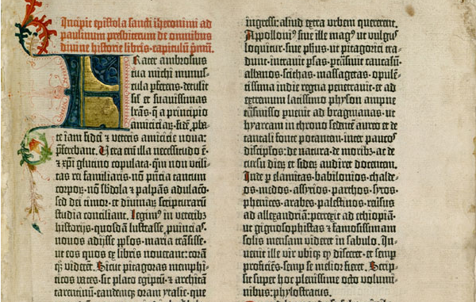
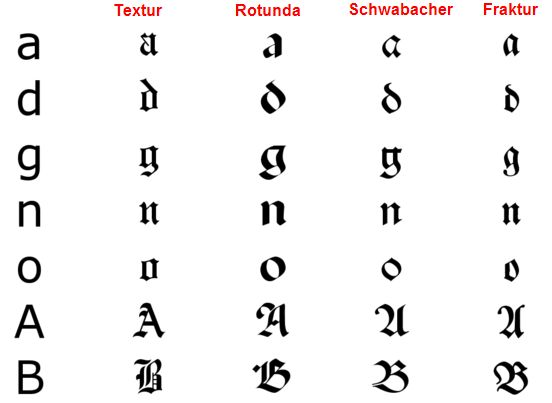
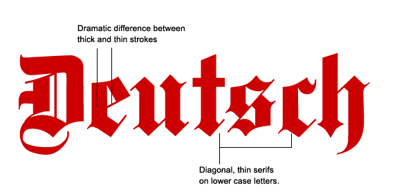

> ### *Blackletter was easily recognizable for its "forceful visual presence, thick and thin strokes and elaborate swirls of the serifs." It became the text of choice for liturgical writings and illuminated manuscripts throughout the Middle Ages.*

**Blackletter:** a font known for its striking similarity to handwriting and renowned among both calligraphers and typographers alike. Although now mainly used for dramatic headings and displays, it was previously the most widely used text during the middle ages. The history of Blackletter predated printing and originated in Europe in the 12th century.

In an increasingly literate society, book producers needed to keep up with the demand for books and, their font of choice, Carolingian Miniscule, which was a direct ancestor of the Blackletter, was far too labour-intensive for mass production. Parchment was expensive, and utilization of space was crucial, but at the same time, they required a font that would stand out when put amid bold and intricate illustrations. That was where Blackletter came in. Blackletter was easily recognizable for its "forceful visual presence, thick and thin strokes and elaborate swirls of the serifs." It became the text of choice for liturgical writings and illuminated manuscripts throughout the Middle Ages.

Perhaps the most significant credit to this font was its usage in setting Guttenburg's 42-line Bible, the first book printed with moveable type. The typeface mimicked the appearance of manuscripts and continued to evolve during its use, and over a period of time, a variety of blackletter styles appeared of which four families could be identified- Textura, Rotunda, Schwabacher and Fraktur. While printing was relatively new in Europe, German printers developed a variety of Blackletter which they called Schwabacher, which proved to be so popular that it began to be the most commonly used one.

For centuries, Blackletter continued to be used for print, alongside roman and italic fonts. After the Protestant reformation, Blackletter became commonly used among the predominantly protestant population of northern Europe while the Roman Catholic parts of Italy and France preferred Roman. However, soon after it began to decrease in popularity due to it being difficult to read, with the exception of Germany. Blackletter continued to be the most used typeface and was used in more than half of the books and newspapers printed at the time. However, after World War II, Blackletter was reduced to the decorative font on beer labels and newspaper headings. In Germany, the use of Blackletter altogether ceased, and it vanished from usage. This was because the National Socialist German Workers' Party had issued a circular to all public officials declaring it to Jewish letters, and prohibiting its use.

Now one would assume that the typeface would become just another memorabilia in typographic history. In the 1990s, during the evolutionary years of graphic designing, designers successfully revived Blackletter as they began to create variations of the font and digitalizing historical fonts. In contemporary society, Blackletter is commonly used for display text. Blackletter fonts such as Fette Fraktur is used for old-fashioned headings and beer labels, and Wilhelm Klingspor Gotisch is used for wine labels. Every beer-lover would recognize the iconic logo of Corona Extra written in the classic, medieval script. Blackletter is also a popular choice for certificates and diplomas. Popular culture continues to take advantage of the script for its medieval, sometimes creepy look, appearing on many a book cover, poster, CD cover, movie title and especially Halloween themed media or products. Blackletter now adorns the iconic logo of The New York Times newspaper and continue to be used as headings for other newspapers.

### BIBLIOGRAPHY

* <https://en.wikipedia.org/wiki/Blackletter#Origins>
* <https://medium.com/@shubhi.dengre/history-of-typeface-styles-and-typeface-classification-be275e101e04>
* <https://nicolebroadhndgraphics.wordpress.com/2016/10/11/history-of-black-letter-and-johannes-gutenberg/><https://www.commarts.com/columns/blackletter-today>
* <https://www.commarts.com/columns/blackletter-today>
* <https://www.fonts.com/content/learning/fyti/typefaces/blackletter>
* <https://www.britannica.com/topic/black-letter>
* <https://ilovetypography.com/2010/03/01/the-library-of-the-gutenberg-museum/>
* <https://www.linotype.com/2221/blackletter-fonts.html>
* <https://lindaaayaa.files.wordpress.com/2016/01/linda-tseng-fontpresentation.pdf>
* <https://www.sitepoint.com/the-blackletter-typeface-a-long-and-colored-history/>
* <https://www.ashworthcreative.com/blog/2014/07/brief-typography-typefaces/#:~:text=1816%20William%20Caslon%20IV%20created,being%20created%20to%20accommodate%20advertising.>