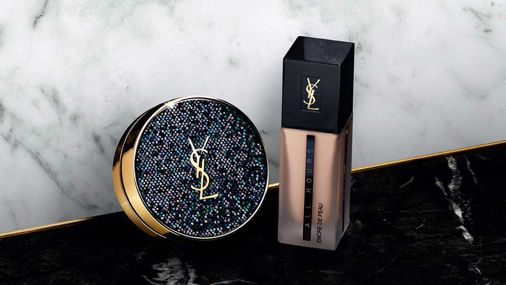
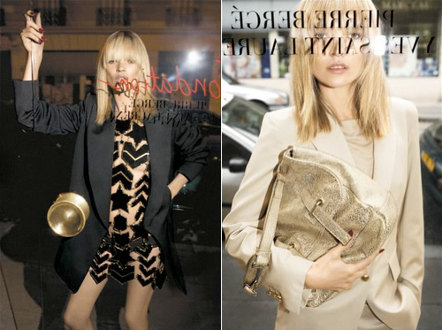

The Yves Saint Laurent logo is what I consider the little black dress of logos: chic, timeless and elegant. Since its creation in 1961, it has emblazoned many a dress, jacket and handbag. It has arguably become one of the most recognizable logos.

A.M. Cassandre was one of the most exceptional designers to be born out of the Art Deco Era. Cassandre was heavily influenced by cubism and surrealism and admired the bold, clean, geometric fonts emblematic of the Art Deco Movement. Prior to working with saint Laurent, he designed several bold typefaces including the Bifur, Acier Noir, and Piegnot, a modulated sans serif used for the covers of the fashion magazine, Harper’s Bazaar.

When French designer Yves Saint Laurent founded the luxury brand in 1961, he needed a logo that would embody his brand. He hired Cassandre who created the iconic monogram of the letters Y, S and L.

What made the logo special was his unconventional use of both sans and serifs, mixing both roman and italic forms in the same logo. Quintessentially, the mixing of two typefaces was considered incongruous- a faux pas of design. At the same time, he had to mix the letters without creating odd corners and uneven lines. The letters flowed from left to right, creating a rhythm between both the capital and small letters.  He challenged the rules to create a logo that was timeless and outstanding.

At the time, the industry was teeming with brands using modern serifs like Didot, Bodoni and Futura. Most luxury brands like Chanel, Louis Vuitton and Harper’s Bazaar used uppercase grotesques to create a modern, smart and professional brand identity. That’s what made the YSL logo original and different.

The logo perfectly captured the brand’s identity- it was both sensual and sophisticated.

The logo was featured in countless collections and became eponymous for the luxury brand identity. JN Kapferer says that the brand stands for “feminine, self-assured and strong-minded 30-year-old woman. The YSL brand celebrates the beauty of body, of charm, of surrender to romance, and is flavoured with a hint of ostentatious indecency.’ The YSL logo is featured on their classic monogram bag, which remains on one the the brand’s bestselling pieces. The logo became symbolic of designer Stefano Pilati’s reign as the head designer of Yves Saint Laurent, appearing in several campaigns during 2004 to 2013 like Spring 08 campaign featuring supermodel Kate Moss peering through a window emblazoned with the logo.

In 2012, as part of its rebranding by creative director Hedi Slimane, the brand was renamed Saint Laurent, and the logo was changed to retro style Helvetica script. The rebranding was met with an onslaught of angry reactions, calling it “cliché” and reminiscent of the Chanel and Dior logos, which only goes to prove the timelessness of the original YSL monogram.  This was followed by a campaign featuring the slogan “Ain’t Laurent without Yves.”

Despite the rebranding, the original logo continues to be used in YSL products ad campaigns. It continues to be the ultimate synonym of luxury and quality.

                                                                                                     

 

 

 

 

**Bibliography**

<https://fashionindustrybroadcast.com/2017/02/02/magic-iconic-yves-saint-laurent-logo/>

<https://www.anothermag.com/art-photography/2069/adolphe-mouron-cassandres-ysl-logo>

<https://medium.com/fgd1-the-archive/yves-saint-laurent-logo-1963-a-m-cassandre-3cd069a83384>

<https://www.creativebloq.com/branding/ysl-logo-7127930>

<https://retrographik.com/a-m-cassandre-art-deco-poster-artist/>

<https://ww.fashionnetwork.com/news/saint-laurent-reveals-its-new-logo,269144.html>