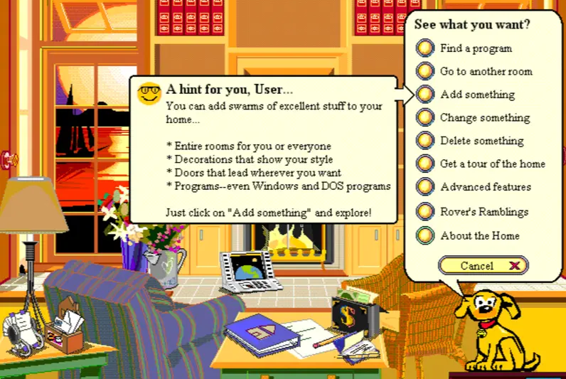
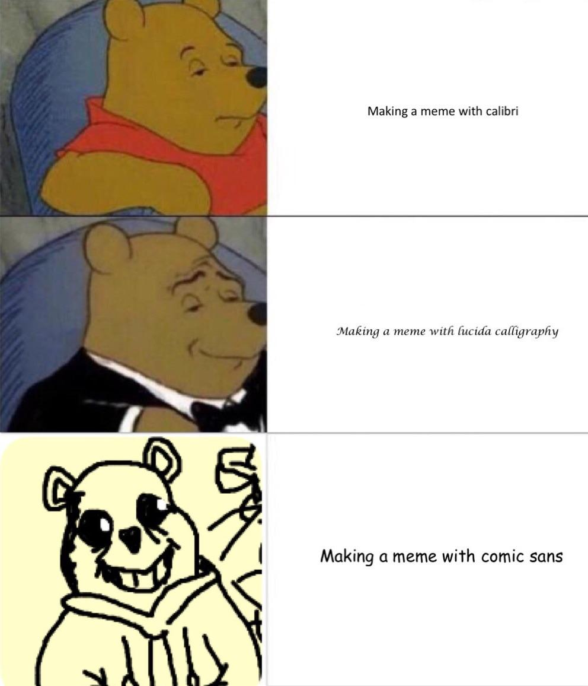
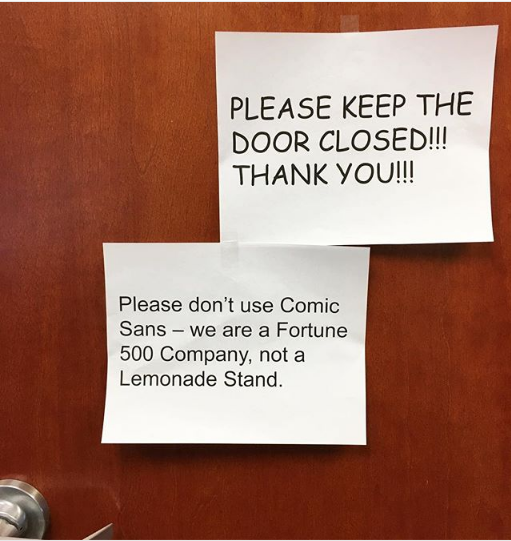

“Comic Sans is a blight on the landscape of typography,” says Dave Combs, the founder of Ban Comic Sans website. Any person who has used a computer probably knows Comic sans. Every person who lives in the social media era probably knows how much the internet hates Comic sans. In fact, the font is despised enough to have its own anti-fan website.

“Comic Sans is a blight on the landscape of typography,” says Dave Combs, the founder of Ban Comic Sans website. “Campaign to eradicate the misuse of the font”, reads the website founded by graphic designers Dave and Holly Combs, who fell in love and married over their mutual hatred of what they considered “the least thoughtful typeface.”

But is as awful as the internet says?

It’s creator disagrees. “If you love Comic Sans you don’t know much about typography. And if you hate Comic Sans you need a new hobby,” says Vincent Connare, graphic designer and creator of the font. He says that Comic Sans was never meant to be a typeface. During his tenure at Microsoft in 1995, he was assigned a beta version of Microsoft Bob, aimed primarily at younger users. The project featured a dog called Rover who talked in Times New Roman. “Dogs don’t talk in Times New Roman!” he said as he realized the choice of font felt oddly incongruous with the cartoon dog. And so Comic Sans was born!

Inspired by *Watchmen* and *The Dark Knight Returns*,  Connare created a font that was fun, outlandish and playful. Each letter was hand-drawn to retain an air of “wonkiness”, a process that took three days. However, the font was finalized too late for Microsoft Bob, and so it didn’t make the cut. Instead, it was released in the Windows 95 Plus Pack and later included as one of the system fonts for the OEM versions of Windows 95.

It was an instant hit. Comic Sans with its child-like jauntiness was a breath of fresh air in a world taut with straight-laced, no-nonsense fonts like Times New Roman and Helvetica. The timing of its release also coincided with a jump in the number of households owning a personal computer. Soon, Comic sans became one of the most commonly used fonts. It was used everywhere from birthday cards to medical documents.

Therein lies the issue with Comic Sans. It not hated because it’s exceedingly terrible, but because of its blatant overuse and misuse. Comic sans is perhaps the aptest example to argue that voice in typography is vital. “People use it inappropriately. If they don’t understand how type works, it won’t have any power or meaning to them,” Connare explained. “I once heard a guy at a Rothko show say, ‘I could have done that.’ He clearly doesn’t know anything about art. He’ll probably use Comic Sans without realizing it’s wrong in certain circumstances.” When a playful font such as Comic Sans is used in professional settings, the visual contradicts with the message and it paradoxical and even disrespectful.  “The misuse of Comic Sans is analogous to showing up for a black-tie event in a clown costume,” argued Dave and Holly Combs.

A large part of what makes the font appear unprofessional is its irregularity and wide spacing. However, these exact qualities make the font easily readable for those with dyslexia. Several dyslexia associations, including the British Dyslexia Association, have recommended it.

The creator himself calls Comic Sans the “Justin Beiber” of fonts and says that he only used the font once in his life. “I was having trouble changing my broadband to Sky so \[I] wrote them a letter in Comic Sans, saying how disappointed I was.” He was promptly issued a refund of £10. Aside from Comic Sans, Connare has also designed Trebuchet MS, another Microsoft font. He says that he doesn’t regret creating one of the world’s most controversial typefaces. Instead, he worries about what this means as a designer,  “In a way, my only regret is that people think that’s the only thing I’ve ever designed.”

#### **References** 

<https://creativemarket.com/blog/the-fascinating-stories-behind-some-of-the-most-unpopular-fonts-on-earth>

<https://www.fonts.com/content/learning/fyti/typefaces/story-of-comic-sans>

<https://www.theguardian.com/artanddesign/shortcuts/2014/jun/04/comic-sans-creator-vincent-connare>

<https://www.todayonline.com/world/hating-comic-sans-not-personality>

<https://www.theguardian.com/artanddesign/2017/mar/28/how-we-made-font-comic-sans-typography>

<https://www.huffpost.com/entry/vincent-connare_n_3837441>

<https://www.independent.co.uk/life-style/gadgets-and-tech/news/why-does-everyone-hate-comic-sans-so-much-2113344.html>

<https://www.cbc.ca/radio/day6/oscar-villains-lynn-beyak-coronavirus-hospitals-weinstein-s-lawyer-the-creator-of-comic-sans-and-more-1.5454398/meet-the-man-who-created-the-comic-sans-font-and-no-he-s-not-sorry-1.5454405>

<https://monchu.uk/comic-sans-story/#:~:text=Comic%20Sans%3A%20the%20origin%20story,as%20a%20typographer%20at%20Microsoft.&text=The%20beta%20version%20was%20using,designed%20for%20a%20child%20audience>.