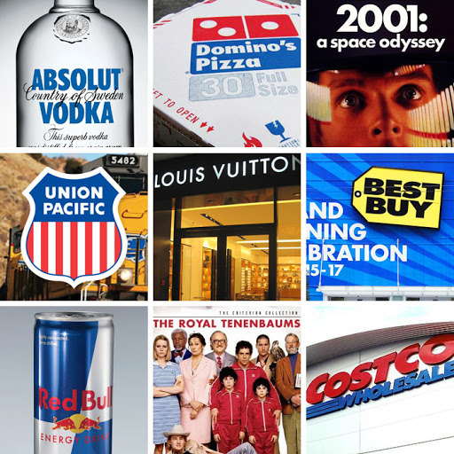

July 10, 1969. As billions of people watch with bated breath, Neil Armstrong climbs down the ladder of the Eagle and proclaims, “That’s one small step for a man, one giant leap for mankind." Buzz Aldrin follows after him. They explore the surface of the moon, collect samples and take photographs. They then planted an American flag, to honour the fallen Apollo 1 crew. It reads, "Here men from the planet Earth first set foot upon the moon. July 1969 A.D. We came in peace for all mankind." In *Futura*.

And so *Futura* become the first font on the moon.

*Futura* was designed by Paul Renner in 1927 as a part of the New Frankfurt Project. The clean geometric sans serif, the design was evocative of the Bauhaus design style. While Renner was not a part of the Bauhaus, he shared their ideology of simple, geometric and modern models. They believed in functionality over beauty and rejected traditional sans serifs or grotesques by stripping forms down to their essence, devoid of any ornamental elements. Upon its release, Futura became an instant hit.

In fact, it was even used by the Nazis. In Nazi Germany, fonts were used as a way of showing allegiance. During the 19th century, most German printing presses two fonts- *Franktur* and Antiqua. The rise of nationalism during the 1900s saw *Franktur* being deemed as more “German.” As a result, modern fonts like *Futura* and *Romeo Medium Condensed* were rejected and shunned. However, in 1941, the Nazis called for the ban of “Jewish” fonts like the *Franktur*. Soon after Futura began to be used as a standard font, over traditional fonts like the *Blackletter*. The Second World War saw the standardization of multiple modern sans serifs, out of which *Futura* stood out the most. Sans serifs were clean, geometric, and more legible than the fonts used at the time.

*Futura* was compatible with both digital and print texts. It enjoyed commercial success which spawned several geometric sans-serif fonts. As a result, it started to appear everywhere from posters, album covers, book covers to logos. In the late 1920s, fashion magazine Vogue commissioned a bespoke version of the font. This followed an onslaught of brands commissioning for their custom versions. Futura became the face of brands like Volkswagon, Nike, Absolut Vodka, Louis Vuitton, and Costco. Its futuristic appearance also made it an ideal font for science fiction movie posters, having been used for films like *2001: A Space Odyssey*, *Gravity* and *Interstella*r. It was used in other films like *V for Vendetta*, *Skyfall* and *American Beauty*.

To this day, Futura remains one of the most commonly used fonts. Sure, there has been some overuse but for the most part, its symmetric, pleasant design is what can be considered “timeless.”

 

**References**

<https://www.sessions.edu/notes-on-design/type-in-history-futura/>

[https://en.wikipedia.org/wiki/Futura_(typeface)](https://en.wikipedia.org/wiki/Futura_(typeface))

<https://design.tutsplus.com/articles/all-about-futura-font-and-its-history--cms-35382>

<https://www.nasa.gov/mission_pages/apollo/apollo11.html>

<https://www.digitalartsonline.co.uk/features/typography/heres-everything-you-should-know-about-futura-on-its-90th-anniversary/#11>

<!--EndFragment-->