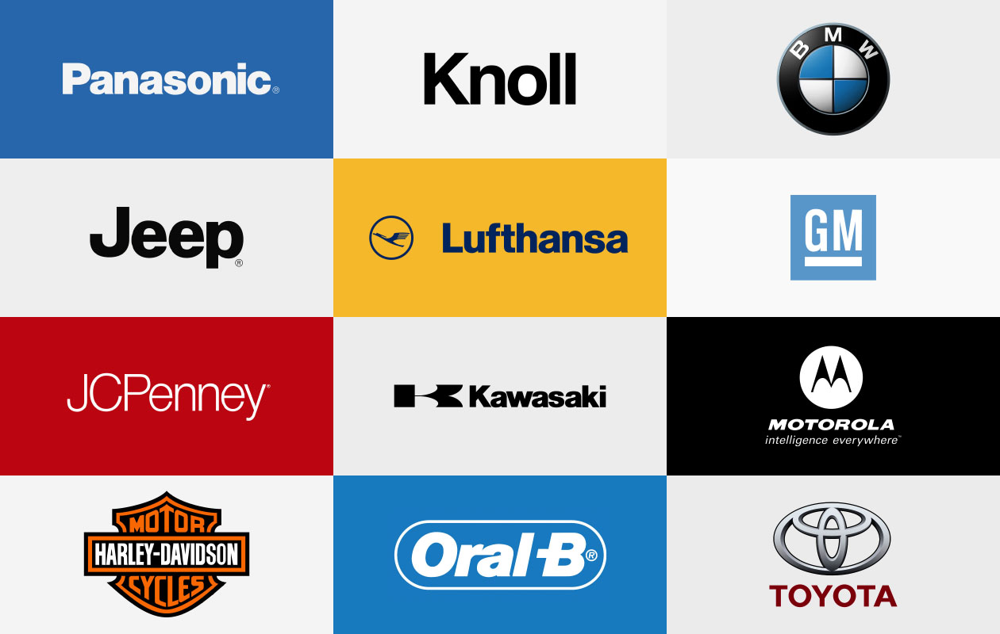
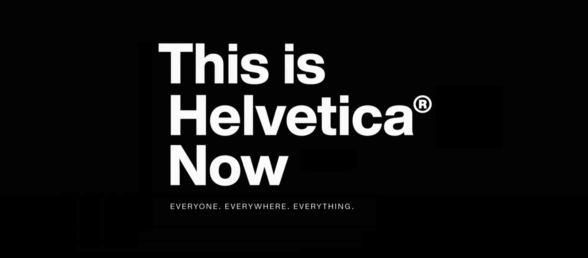

Born out of the modern movement, Helvetica became one of the most popular fonts of the 20th century. During the 50’s Eduard Hoffman who served as co-director of Hass Type Foundry in Münchenstein, Switzerland collaborated with Swiss typeface designer Max Miedinger to create a font similar to Akzidenz Grotesk, which was initially designed in 1869. Originally released as *Neue Haas Grotesk*, it was adopted by Stempel and Linotype for hot metal composition, the standard typesetting method at the time for body text, and on the international market. To make it more marketable, it was renamed to Helvetica in the 1960s. The font was sold to Adobe, Apple, and Xerox, fortifying its identity in the world of design. The typeface soon gained popularity in the Europe, after a multitude of companies adopted it as their brand identity. Helvetica was adopted by Apple as its official font. The iconic BMW logo uses the font, as does the electronics brand LG. Toyota, Panasonic, Target, Nestle, American Airlines, and an array of other companies picked up on the font.

**Why Helvetica?**

To put it simply, Helvetica is like water, or as Monotype Type Director Charles Nix says, “It’s vanilla. It’s paper. It’s a fundamental container for thought.”

It’s plain, average and clean. To the average person, it has no distinctive characteristics that makes it particularly outstanding. And that’s exactly why brands love it so much. They love its neutrality. It grants it the ability to be used anywhere from logos to signs.

“This blankness is its power,” says Nix. “Major corporations see Helvetica as the ultimate expression of typography, the transparent container for the message of their brand. It does its job so incredibly well that it equates them with itself. It isn’t a Serif, so it’s not committed to some old style, and it isn’t new. It’s simply the thing.”

**So, what happened?**

Born into the world of print, Helvetica was never meant for digital use.

“Helvetica sucks. It really wasn’t designed for small sizes on screens. Words like milliliter can be very difficult to decipher. If you ever had to read or write a password with 1, i, l or I, you know the problem.”, says German typeface designer Erik Speikermann. Helvetica with its lack of proper spacing and uniformity makes it poorly suited for a digital interface. The minimalistic and neutral appearance with its straight cut alphabets with sharp corners, makes it difficult to differentiate between letters and creates issues with legibility. While it may work for headlines and logos, its closed apertures make it unsuitable for body text. It also lacks proper hinting, or screen optimization, which means to adjust the font for maximum readability at all sizes and resolutions.

After the release of the MacIntosh OS, Helvetica was made available to the public. Soon it became omnipresent. Monotype Senior Designer Jim Ford says, “After the 80s and 90s, Helvetica became synonymous with the term ‘default;’ the font you get when you don’t choose a font. Helvetica was shunned when I went to college. If you used it, professors got the impression that you didn’t think seriously about the typography.”  In a sense, it became a victim of its own success.

The beginning of its end came in 2011 when Google replaced Helvetica for an original font called Roboto. In 2013, Apple followed suit by introducing a new font called San Francisco. Then, in 2016, CNN switched to a font called CNN Sans. Lately, several brands have abandoned Helvetica for their own bespoke fonts better suited for a digital interface. Now brands seek individuality over neutrality.

**What Now?**

In 2019, Monotype announced that the font would be receiving a facelift. Titled Helvetica New, the revamped font features completely redrawn characters for easier reading and proper hinting which renders better on smaller screens. Maybe, just maybe, we’ll start seeing more of it again.

 

 

#### **References**

<https://envato.com/blog/death-of-helvetica-rise-of-the-bespoke-font/#:~:text=Popular%20with%20Madison%20Avenue%20in,font%20previously%20have%20switched%20typefaces>.

<https://www.monotype.com/resources/articles/complicated-legacy-helvetica>

<https://medium.com/@charliesneath/death-to-helvetica-9937cf79c48c>

<https://slate.com/human-interest/2013/11/helvetica-why-do-some-love-the-font-and-others-hate-it.html#:~:text=Functionality.,in%20these%20kinds%20of%20settings>.

<https://medium.com/@msilvertant/why-is-helvetica-bad-e6b281672ee3>

<https://medium.muz.li/the-new-old-kid-on-the-block-helvetica-now-d873c695d5d6>

<!--EndFragment-->