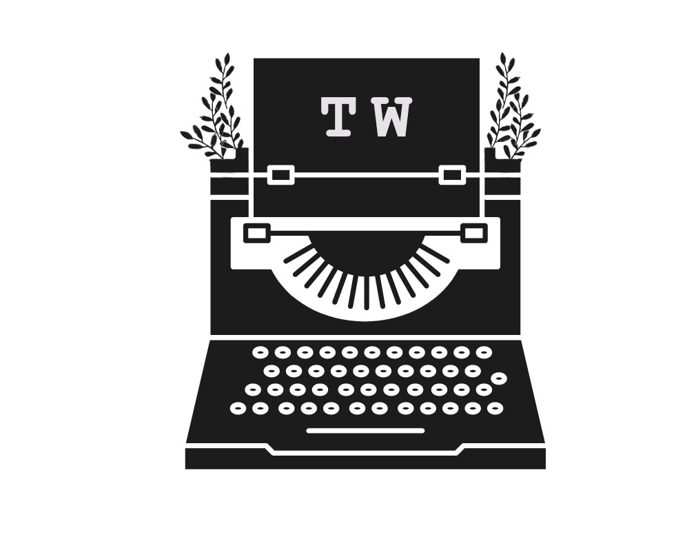
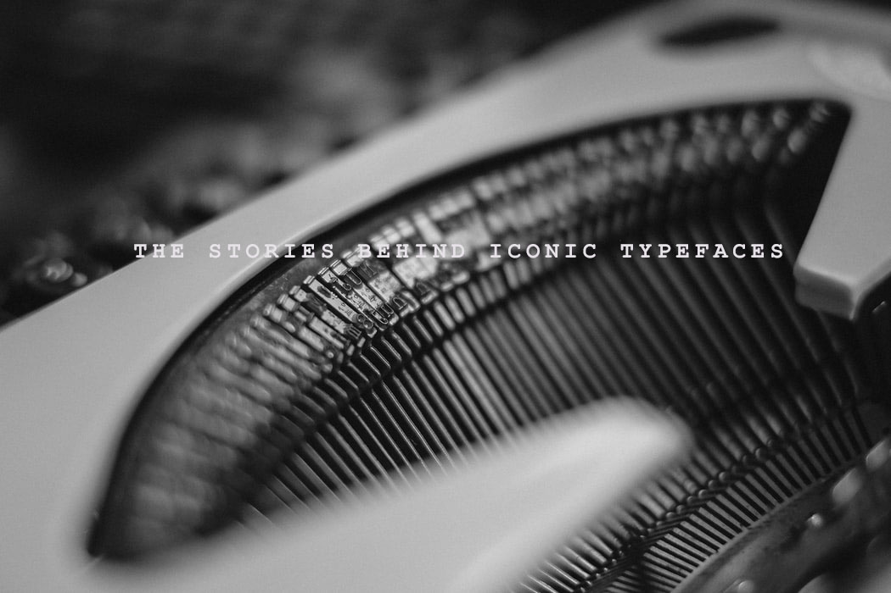

### ABOUT ME

I'm Rithika, an aspiring journalist with a fascination towards creative media. Typography has always fascinated me. Every printed word, be it on a book, on a sign or even on a bottle, is a typeface. Each one carefully curated by designers to represent the item it speaks for. Each typeface, face and lettering has a story. Through this blog, I want to explore the stories behind some commonly used typefaces. If you enjoy typefaces just like me, I invite you to have a read!

### MY LOGO 

The logo is simple, clean and monochromatic. The symbol used is of a typewriter, with the words "TW" on the paper fed into it. "TW" is simply an abbreviated term for the name of the blog. The font I have chosen to use is Courier New, due to its resemblance to typewritten print, in size 72 for better visibility.

### MY BANNER 

The picture I have chosen for my banner is a close-up shot of a typewriter with the phrase "the stories behind iconic typefaces" on it. I have opted to use a monochromatic palette to maintain an evocative, clean and minimalistic ambience. Like the logo, I have used the font Courier New with wide spacing to mimic the appearance of the typewritten print.